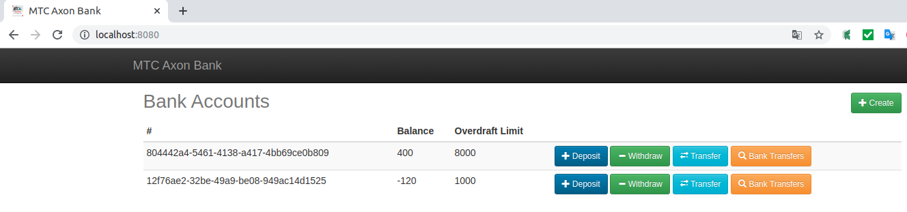
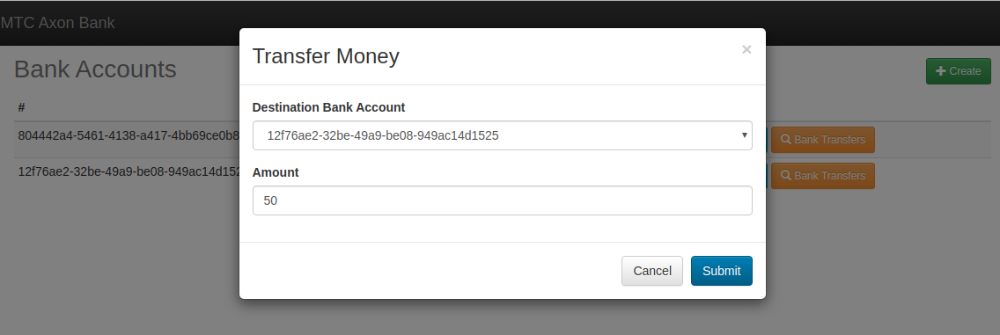
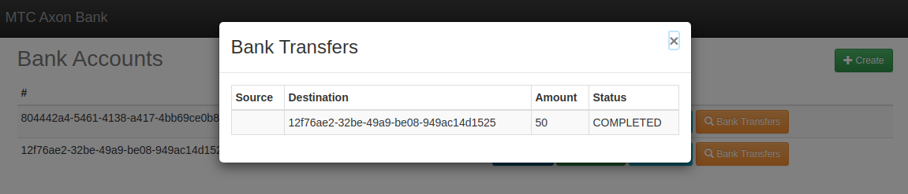

# MTC Axon Bank
Esta es una aplicación de muestra con el propósito de mostrar las capacidades de Axon Framework.

## Dominio
MTC Axon Bank se preocupa por el dominio bancario. La aplicación consta de 2 agregados: cuenta bancaria y transferencia bancaria. Hemos tratado de encontrar un equilibrio apropiado entre complejidad y simplicidad. La aplicación está diseñada para ser lo suficientemente compleja como para mostrar bloques de construcción interesantes proporcionados por Axon Framework. Pero no queríamos que las personas se perdieran en la lógica empresarial de la aplicación.

## Construccion de la aplicacion con Axon Server
Hemos tratado de mantener la aplicación autónoma. Está construido con Spring Boot y, por lo tanto, no requiere que tenga instalado Tomcat.

Hay dos formas de ejecutar la aplicación: en un solo nodo y en varios nodos con Docker.

Ejecutar la aplicación en un solo nodo no requiere que instales ninguna dependencia. El almacenamiento de datos se realiza en la memoria y no requiere que ejecute un almacén de datos externo.

La versión distribuida requiere la instalación de Docker y Docker Compose. Hay 4 contenedores involucrados en la versión distribuida: 1 contenedor que ejecuta MySQL, 1 contenedor que ejecuta RabbitMQ y 2 contenedores que ejecutan instancias de MTC Axon Bank. El servidor MySQL se utiliza para el almacenamiento de eventos, sagas y datos secundarios de consultas. RabbitMQ actúa como un agente STOMP dedicado. STOMP se usa en combinación con WebSockets. El agente STOMP dedicado es necesario para mantener sincronizadas las interfaces de ambas instancias de MTC Axon Bank. Los comandos se distribuyen entre los contenedores que ejecutan MTC Axon Bank con DistributedCommandBus.

## Build y Despliegue
Para ejecutar la versión de nodo único, puede ejecutar los siguientes comandos:
* `mvn clean install`
* `java -jar web/target/axon-bank-web-1.0.0-SNAPSHOT.jar`.

La versión distribuida se puede ejecutar con los siguientes comandos:

* `mvn clean install`
* `mvn -pl web docker:build`
* `docker-compose up db` 
(esto creará e inicializará el contenedor db, puede detener el contenedor después de que se haya inicializado)
* `docker-compose up`

Una vez que se ejecutan todos los contenedores, puede acceder a cada instancia de MTC Axon Bank visitando [http://localhost:8080/] y [http://localhost:8081/]

Permite crear Cuentas de usario con un monto de linea, a la que se puede depositar y retirar dinero:

Se puede realizar las transferencias:

Cuando se completa la transaccion via saga, se confirma el evento a completado:

